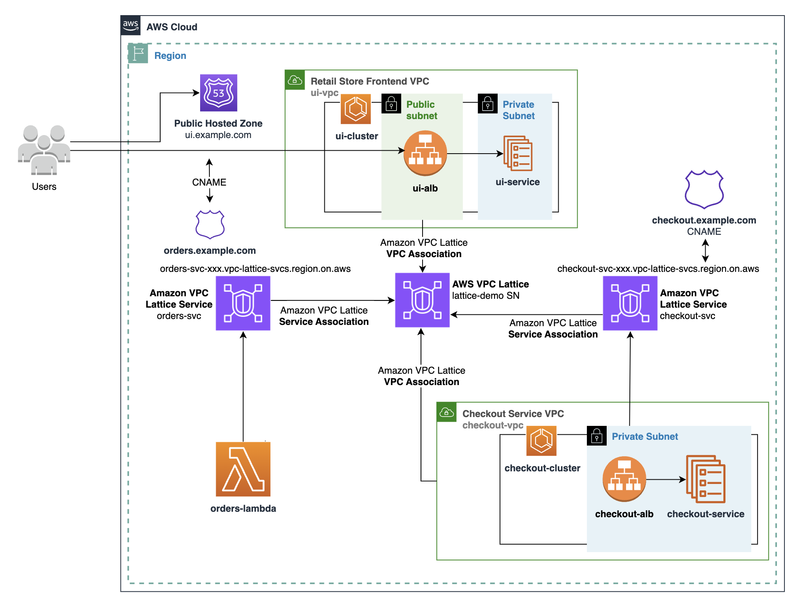
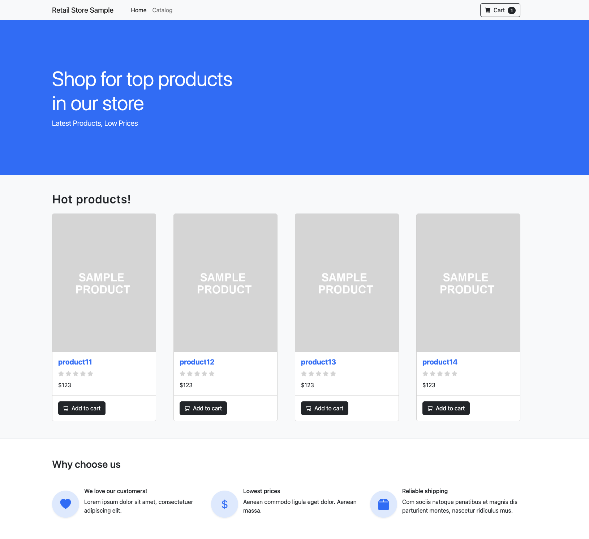

# Welcome to `Build secure application networks with Amazon VPC Lattice, Amazon ECS, and AWS Lambda` Blog

This project consists of sample code to seamlessely connect Amazon ECS and AWS Lambda workloads using Amazon VPC Lattice.

## High Level Architecture



## What are the pre-requisites?

```sh
npm install -g -f aws-cdk@2.87.0
git clone https://github.com/aws-samples/connect-ecs-lambda-workloads-using-amazon-vpc-lattice
cd connect-ecs-lambda-workloads-using-amazon-vpc-lattice
```

* You have configured AWS CLI using `aws configure`
* You have the set the `AWS_REGION` within `aws configure`
* The role being used from CLI has the permissions required for resources being created by CDK
* A public DNS domain - like `example.com`
* A wild card SSL certificate for your domain

## How can we deploy the stack?

* Install dependencies and build

```sh
npm install
```

* Update the below lines with your own values in `./bin/scripts/env.sh` file

```sh
export AWS_REGION="us-west-2"
export CERT_ARN=<<YOUR AWS CERTIFICATE MANAGER CERT ARN>>
export CUSTOM_DOMAIN_NAME=<<YOUR DOMAIN NAME>>
export HOSTZONE_ID=<<YOUR ROUTE53 HOSTEDZONE ID>>
```

* Test the build

```sh
./bin/scripts/build-stack.sh
```

* Deploy the stack

```sh
./bin/scripts/deploy-stack.sh
```

## Test the application

* Launch a web browser and navigate to `https://YOUR_DOMAIN_NAME/`



## Cleanup

```sh
./bin/scripts/destroy-stack.sh
```

## Security

See [CONTRIBUTING](CONTRIBUTING.md#security-issue-notifications) for more information.

## License

This library is licensed under the MIT-0 License. See the LICENSE file.

